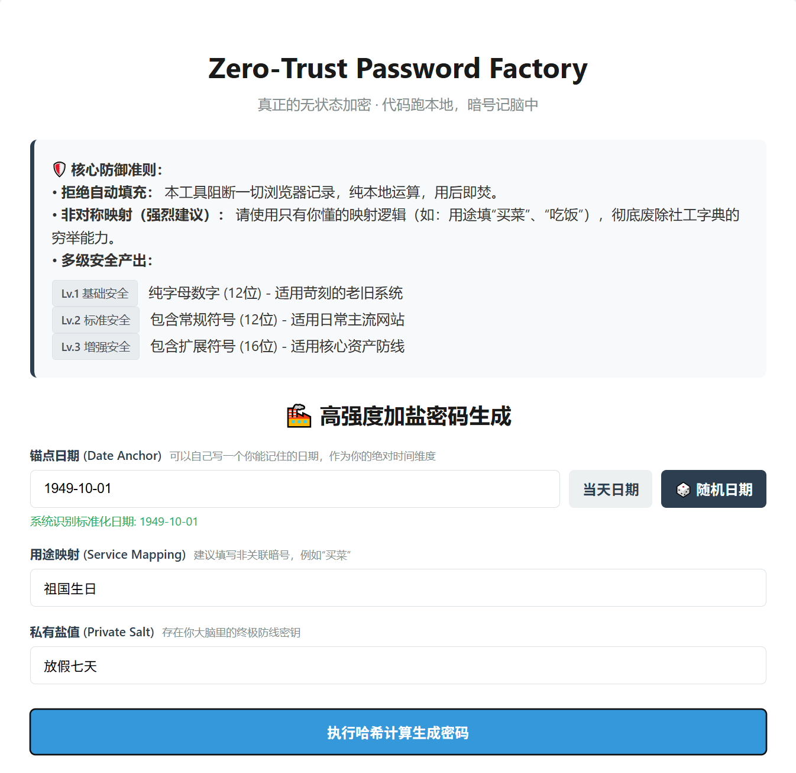
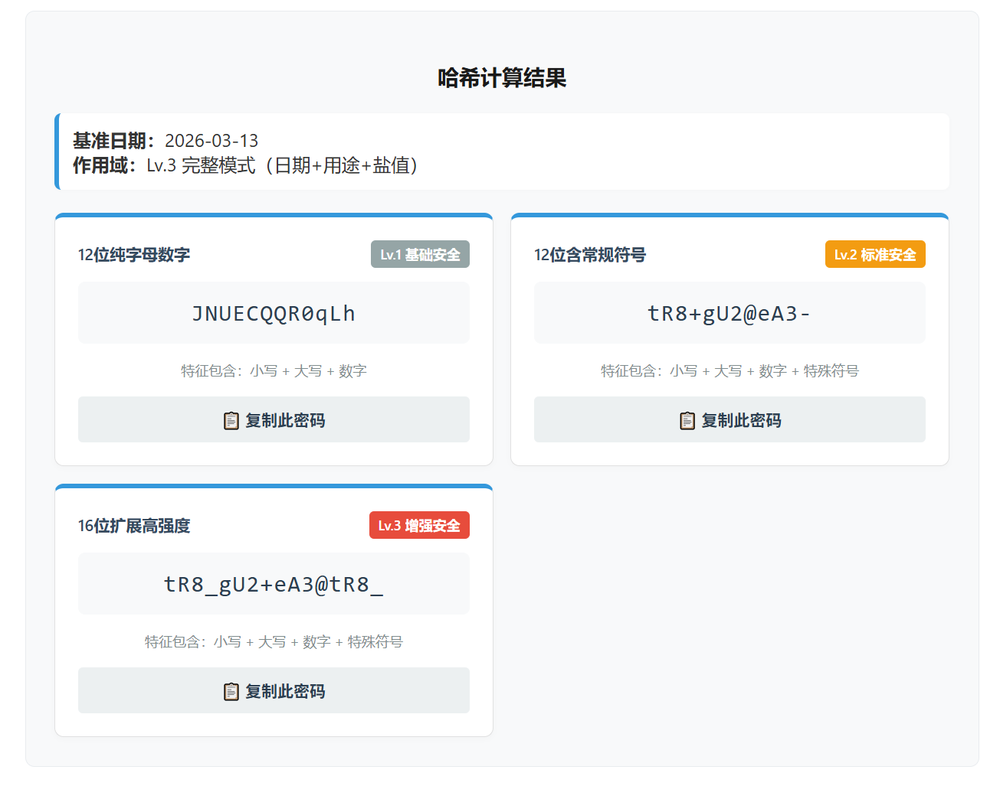
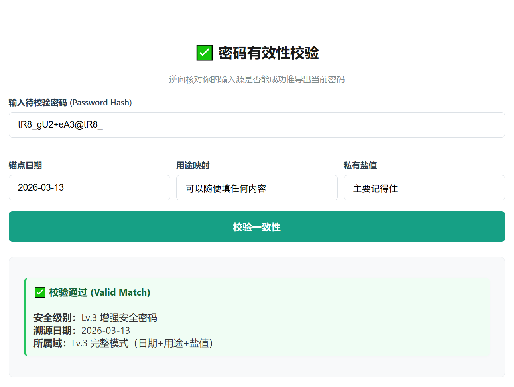
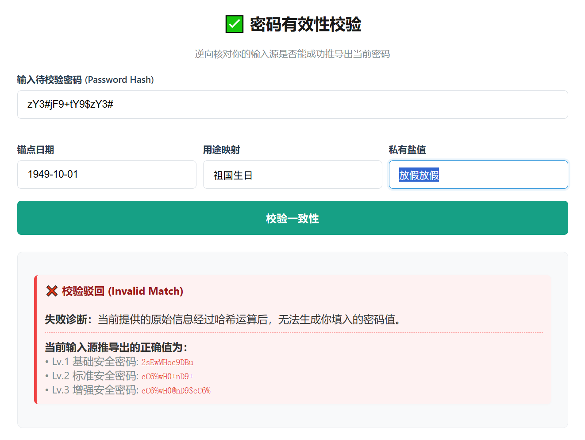

# 🔐 Zero-Trust Password Factory (零信任密码工厂)

> **🛡️ 零信任无状态密码工厂。基于「日期+用途映射+私有盐值」的确定性哈希算法。零存储，用后即焚，代码跑本地，暗号记脑中，彻底免疫社工字典！**
> 
> *Zero-Trust stateless password factory. Generate deterministic hashes via [Date + Service + Secret]. No database, 100% offline, anti-OSINT.*

---

### 🌐 [立即在线体验 (Live Demo)](https://sowahsun.github.io/Zero-Trust-Password-Factory/)

---

## 📸 界面演示 (Interface Preview)

本项目通过物理隔离和脑内逻辑映射，实现了最高等级的个人密码防线。

### 1. 确定性密码生成 (Deterministic Generation)
输入你的“生活暗号”，瞬间生成多级别高强度哈希。

### 2. 多级安全产出 (Multi-level Security)
根据不同场景需求，提供基础、标准、增强三种安全等级。

### 3. 闭环一致性校验 (Integrity Verification)
随时核对你的“脑内坐标”是否正确。

### 4. 安全过程可视化 (Security Process Visualization)
直观展示确定性哈希和物理隔离的密码生成流程。
*Visualize the deterministic hashing and physical isolation password generation process.*

---

## ✨ 核心特性 (Key Features)

* **真正的零信任 (True Zero-Trust)**：没有服务器数据库，没有云端同步。所有的计算都在你的浏览器本地完成。
* **物理维度隔离 (Physical Isolation)**：阻断浏览器自动填充，防止密码在不可见的环境中被窃取。
* **抗社工字典攻击 (Anti-OSINT)**：通过「用途映射」和「私有盐值」，即便攻击者掌握你的个人真实资料，也无法解密你的密码逻辑。
* **双版本支持 (Dual-Version)**：
    * `index.html`: 纯前端 JS 版本，完美支持 GitHub Pages 托管，完全断网可用。
    * `index.php`: 后端自托管版，适合部署在 NAS、软路由等个人私有服务器。

---

## 🚀 快速开始 (Quick Start)

1.  **访问地址**：打开 [在线演示](https://sowahsun.github.io/Zero-Trust-Password-Factory/) 或在本地运行 `index.html`。
2.  **设置锚点日期**：选择一个只有你记得的日子（如：第一次吃某家餐厅的日子）。
3.  **填写用途映射**：建议使用非关联暗号（如：注册淘宝填“买菜”）。
4.  **注入私有盐值**：你脑海中最深处的一句暗语。
5.  **点击生成**：获得你的专属高强度密码。

---

## 🛠️ 部署说明 (Self-Hosting)

如果您希望在自己的设备上运行：

* **静态部署**：直接将 `index.html` 放入任何 Web 根目录，或直接用浏览器打开。
* **PHP 部署**：确保您的服务器支持 PHP 7.4+，上传 `index.php` 即可使用。

---

## 📜 许可协议 (License)

本项目采用 [MIT License](LICENSE) 开源。

---
*代码跑本地，暗号记脑中。愿你的数字资产永远安全。*
